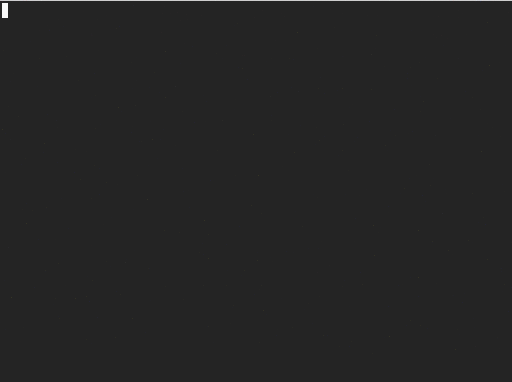

# Prox Please

Download the list of proxies on Hidemyass.com straight to stdout.

### Usage



```bash
	proxplease
```

### Installation

```bash
	npm install -g proxplease
```

### Notes

Proxease is a thin wrapper around HMA-Proxy-Scraper to make it easier to use. Since that library is not in npm, I forked and used it. 100% credit to the original author.

